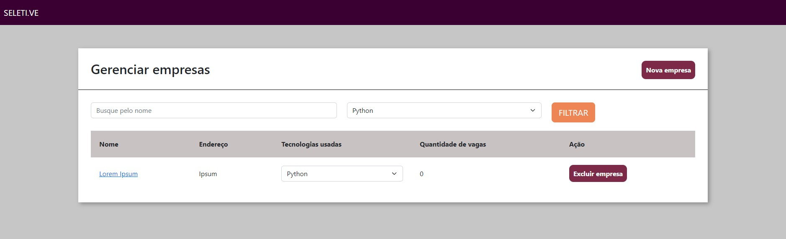
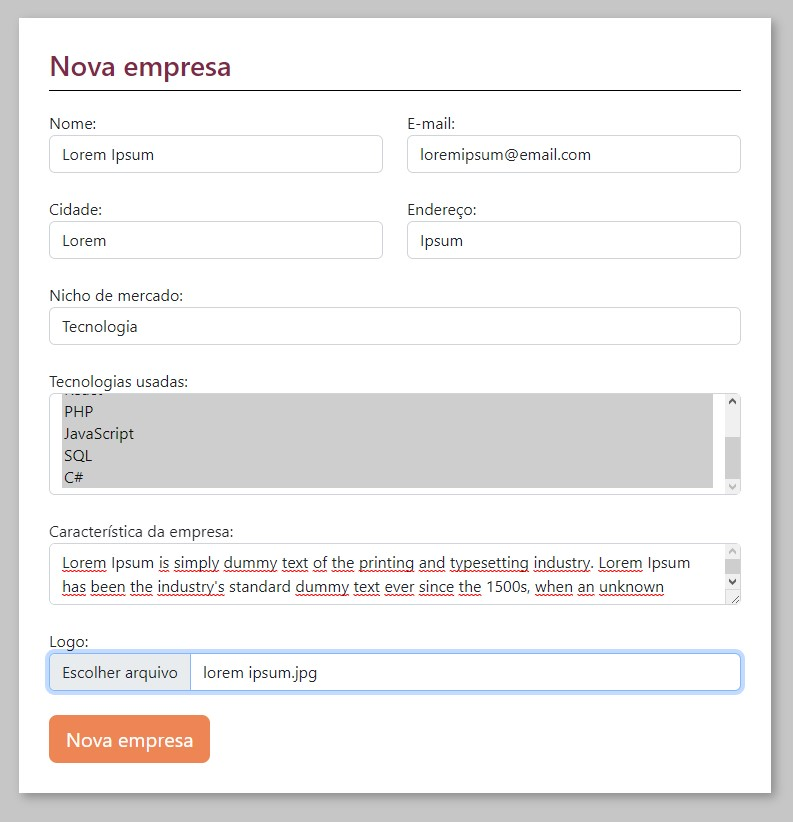
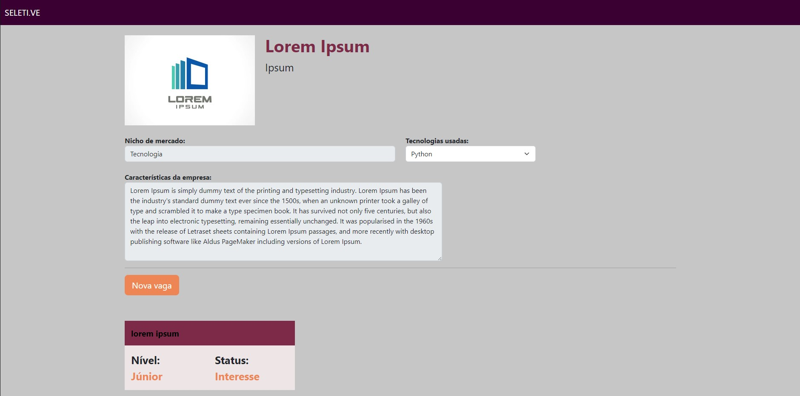
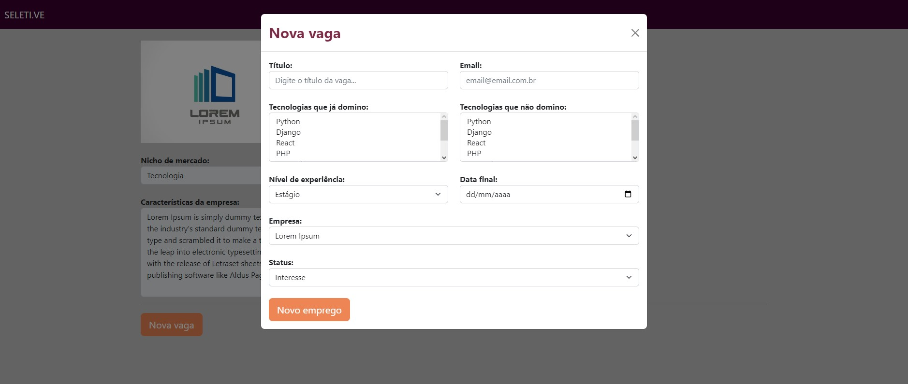
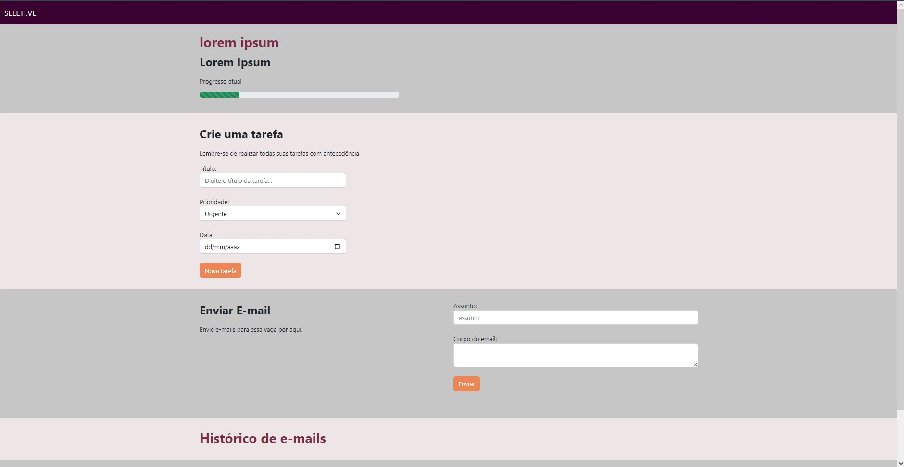
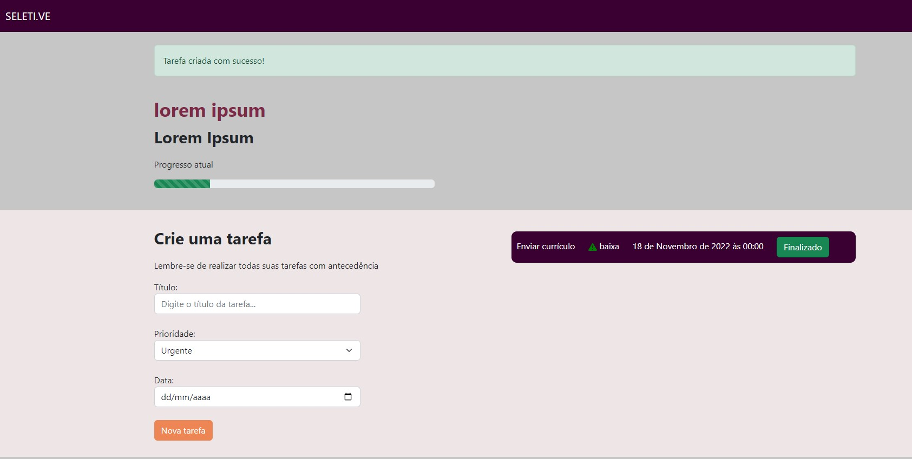
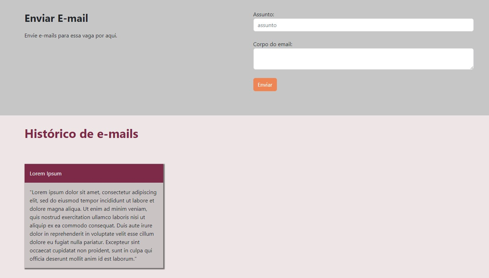

# Seletive

<p align="center">
  <a href="https://www.djangoproject.com" target="blank"></a>
</p>

<p align="center">
  <a href="#-tecnologias">Tecnologias</a>&nbsp;&nbsp;&nbsp;|&nbsp;&nbsp;&nbsp;
  <a href="#-projeto">Projeto</a>&nbsp;&nbsp;&nbsp;|&nbsp;&nbsp;&nbsp;
  <a href="#-como-executar">Como executar</a>
</p>


<hr>

<a id="-tecnologias"></a>

## Tecnologias

Esse projeto foi desenvolvido com as seguintes tecnologias:


<hr>

<a id="-projeto"></a>

## 💻 Projeto

Seletive é um sistema desenvolvido para a gerencia de candidaturas em vagas de emprego, nele é possível cadastrar/excluir empresas, adicionar vagas disponíveis, fazer filtros de empresas de acordo com as tecnologias utilizadas, criar tarefas para ser feitas durante o processo seletivo, e envio de emails para as empresas. 

<p align="center">
  

  

  

  

  

  

  
</p>

<a id="-como-executar"></a>

## 🚀 Como executar

### 💻 Pré-requisitos
 **Antes de começar, verifique se você atendeu aos seguintes requisitos:**

- Você tem uma máquina `< Windows / Linux / Mac >`.

- Você tem python na versão 3.11 ou superior instalado em sua máquina.


### Como instalar localmente:

- clone ou baixe o repositório.

```bash
# Clone este repositório
$ git clone https://github.com/gustavonovais1/Seletive.git

# Entre na pasta
$ cd Seletive
```

2 - inicie um ambiente virtual

```bash
# Criar
  # Linux
    $ python3 -m venv venv
  # Windows
    $ python -m venv venv


```
3 - Ativar
```bash

  # Linux
    $ source venv/bin/activate
  # Windows
    $ venv/Scripts/Activate

# Caso algum comando retorne um erro de permissão execute o código e tente novamente:

  $ Set-ExecutionPolicy -Scope CurrentUser -ExecutionPolicy RemoteSigned

```
3 - Configuração inicial
```bash

### Para total funcionamento da aplicação ainda é necessário fazer as migrações para gerar o esquema de banco de dados:

# Linux
python3 manage.py migrate
# Windows
python manage.py migrate

### Criando um usuário para acessar o painel de administração:

$ python3 .\manage.py createsuperuser
$ python .\manage.py createsuperuser

```
### 👨‍💻 Ativando a aplicação (localmente)

Para executar o servidor localmente (Com o ambiente virtual ativo):

```bash
# Linux
$ python3 manage.py runserver
# Windows
$ python manage.py runserver

Agora é possível acessar a aplicação em http://localhost:8000/
